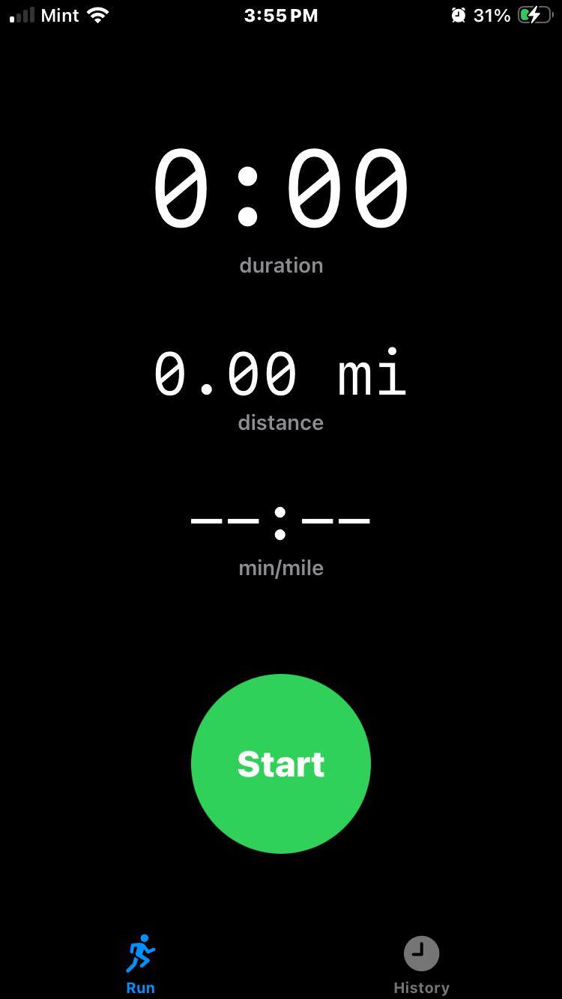
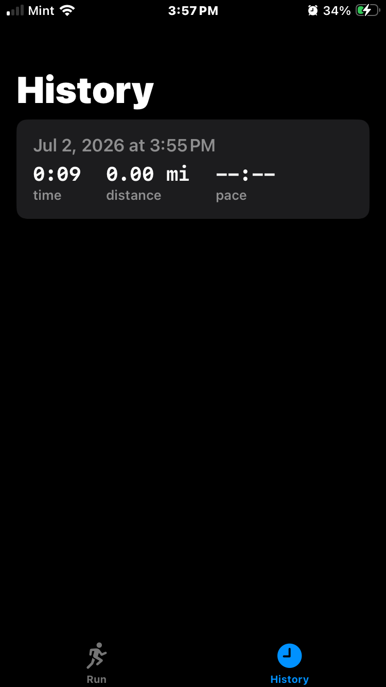

# Runner

A minimal iOS running tracker built with SwiftUI.

## Screenshots

  
  

## Features

- **Live run tracking** — tracks duration, distance, and average pace in real time using CoreLocation
- **Pause & resume** — pause a run and pick up where you left off
- **Average pace** — displays current pace in min/mile while running
- **Run history** — completed runs are saved locally and listed with time, distance, and pace
- **Swipe to delete** — remove runs from history with a swipe

## Requirements

- iOS 17+
- Xcode 15+
- A physical iPhone for GPS tracking (simulator has no GPS)

## Getting Started

1. Clone the repo
2. Open `Runner.xcodeproj` in Xcode
3. In **Signing & Capabilities**, set the team to your Apple ID
4. Select your iPhone as the destination and press **⌘R**
5. On first launch, allow location access when prompted
